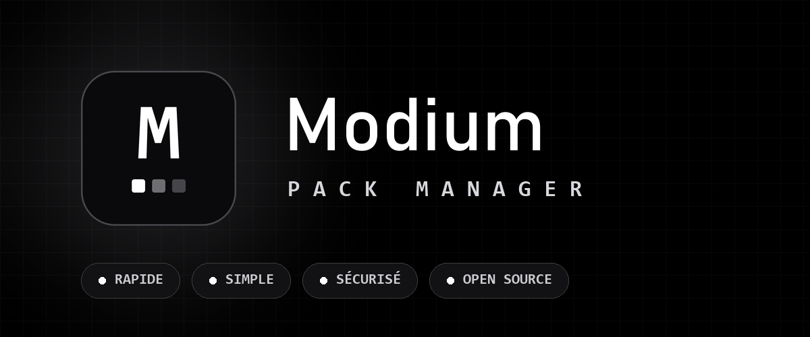
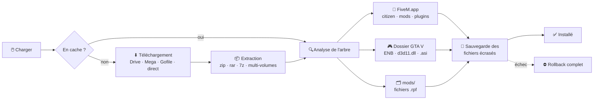

<div align="center">



<br><br>

[](../../releases/latest)


**Installe et désinstalle tes packs graphiques FiveM en un clic.**
QuantV · NVE · ReShade · ENB · mods · plugins

</div>


## Le problème

Installer un pack graphique à la main, c'est ouvrir l'archive, deviner où va
chaque dossier, en copier une partie dans `FiveM.app`, l'autre dans le dossier
de GTA V, écraser des fichiers sans savoir lesquels — et prier pour pouvoir
revenir en arrière.

**Cette app fait tout ça pour toi, et sait défaire ce qu'elle a fait.**

<div align="center">

</div>


## Installation

<table>
<tr>
<td width="50%" valign="top">

### ⚡ Installeur

Télécharge le `.exe` depuis les [**Releases**](../../releases/latest) et
double-clique.

Pas de droits administrateur, pas d'UAC. Raccourci Menu Démarrer, entrée dans
« Applications et fonctionnalités », désinstallation propre.

</td>
<td width="50%" valign="top">

### 🛠 Depuis le source

Nécessite [Python 3.10+](https://www.python.org/downloads/)
avec *Add Python to PATH* coché.

```bash
git clone https://github.com/ImSerial/modium
cd modium
Lancer.bat
```

</td>
</tr>
</table>

> [!NOTE]
> **« Windows a protégé votre PC » au premier lancement ?** C'est normal :
> l'application n'est pas signée par un certificat payant. Clique sur
> **Informations complémentaires** puis **Exécuter quand même**. Le code
> source est entièrement dans ce dépôt, tu peux le lire.


## Utilisation

| | Bouton | Ce qu'il fait |
|:--:|---|---|
| ⬇ | **Charger** | Télécharge le pack si besoin, l'extrait, l'installe. Sauvegarde tout fichier écrasé. |
| ↩ | **Décharger** | Retire exactement ce qui a été installé, restaure les originaux, nettoie les dossiers vides. |
| ▶ | **Preview** | Ouvre la vidéo de présentation du pack, quand il y en a une. |
| ✕ | **Annuler** | Stoppe un téléchargement en cours et nettoie derrière lui. |

La console en bas décrit chaque action en direct. La **taille du pack** est
affichée sur sa carte avant même de le télécharger.

> [!IMPORTANT]
> Ferme FiveM et GTA V avant de charger ou décharger. L'app refuse de continuer
> sinon — les fichiers seraient verrouillés et l'installation à moitié faite.

> [!NOTE]
> Les packs en `.rar` demandent **WinRAR ou 7-Zip** installé sur le PC.
> Les `.zip` fonctionnent partout.


## Ce qui se passe quand tu cliques sur Charger



Chaque créateur range son pack à sa façon. L'app parcourt **tout** l'arbre et
répartit selon ce qu'elle trouve, quel que soit le niveau où c'est rangé.

<details>
<summary><b>Le détail du routage</b></summary>

<br>

| Dans le pack | Destination |
|---|---|
| `citizen/`, `mods/`, `plugins/`, `reshade-*` | `%LOCALAPPDATA%\FiveM\FiveM.app` |
| contenu de `GTAV/` ou `GTA5/` (ENB, `d3d11.dll`, `.asi`, `.ini`) | dossier d'installation de GTA V |
| fichiers `.rpf` | toujours `mods/`, au même sous-chemin que l'original |
| readme, screenshots, dossiers parasites | ignorés |

Cas particuliers gérés :

- pack ENB « nu », sans dossier wrapper `GTA5`
- `.asi` isolé, installé dans `plugins/` avec son `.ini` de config
- archives multi-volumes : `.part1.rar`, `.r00`/`.r01`, `.7z.001`
- archives imbriquées (`FIVEM.rar` + `GTA5.rar` dans le téléchargement)
- dossiers en majuscules laissés par une vieille install manuelle
- noms de dossiers exotiques : `GTA V Legacy`, `SinglePlayer`, `FIVEM FILES`…

Les deux dossiers de jeu sont détectés automatiquement (registre, `CitizenFX.ini`,
chemins connus dont les variantes *Legacy*). Réglables à la main dans
**Options → Avancé** si la détection se trompe.

</details>


## Sécurités

<table>
<tr>
<td width="33%" valign="top">

**🔒 Avant**

Refuse de travailler si FiveM ou GTA V tourne. Vérifie l'espace disque sur
chaque disque concerné. Garde anti double-chargement.

</td>
<td width="33%" valign="top">

**⚙️ Pendant**

Interdit toute écriture hors des dossiers cibles. **Rollback automatique** si
l'installation échoue en cours de route.

</td>
<td width="33%" valign="top">

**↩️ Après**

Le déchargement retire exactement ce qui a été posé et restaure les originaux.
Le jeu revient propre.

</td>
</tr>
</table>

Un dossier remplacé en entier (`enbseries`, `reshade-shaders`…) est mis de côté
complet, jamais mélangé avec l'ancien, et remis au déchargement. `citizen`,
`update`, `x64`, `dlcpacks` ne sont jamais purgés : fusion classique, avec
sauvegarde fichier par fichier.

Les téléchargements **reprennent après une coupure réseau** au lieu de tout
recommencer, et le désinstalleur refuse de partir tant qu'un pack est encore
installé dans le jeu.


## Ajouter tes propres packs

**Options → Mes packs**, colle un lien.

<table>
<tr>
<td align="center" width="25%"><b>Google Drive</b><br><sub>fichier ou dossier entier</sub></td>
<td align="center" width="25%"><b>Mega.nz</b><br><sub>déchiffrement AES client</sub></td>
<td align="center" width="25%"><b>Gofile</b><br><sub>API fermée, voir dépannage</sub></td>
<td align="center" width="25%"><b>Lien direct</b><br><sub>.rar · .zip · .7z</sub></td>
</tr>
</table>

Pour un **dossier** Google Drive, l'arbre est reconstruit et téléchargé fichier
par fichier ; les archives qu'il contient sont extraites automatiquement.

Champs image et preview YouTube optionnels. **Modifier** repréremplit le
formulaire ; la croix retire le pack **et** ses fichiers téléchargés, après
confirmation.


## Héberger ta propre liste

L'app pointe par défaut sur une liste publique. Pour servir la tienne, indique
l'URL de ton `packs.json` dans **Options → Avancé**, ou builde un exe avec ton
propre `embedded_config.json`.

<details>
<summary><b>Format du <code>packs.json</code></b></summary>

<br>

```json
{
  "packs": [
    {
      "name": "QuantV",
      "url": "https://exemple.com/quantv.rar",
      "version": "2",
      "size": "4.1 Go",
      "image": "https://exemple.com/quantv.webp",
      "preview": "https://youtu.be/xxxxxxxxxxx"
    },
    { "name": "NVE", "file": "nve.rar", "version": "1" }
  ]
}
```

| Champ | Rôle |
|---|---|
| `name` | obligatoire, sert d'identifiant et de nom de dossier |
| `url` | lien externe direct vers l'archive |
| `file` | *alternative à `url`* : fichier posé à côté du `packs.json` |
| `version` | incrémente-la pour forcer le re-téléchargement |
| `size` | affiché sur la carte avant téléchargement |
| `image` | lien externe, ou fichier à côté du `packs.json` |
| `preview` | lien vidéo, affiche un bouton Preview |

Une entrée mal formée est ignorée, elle ne casse pas le reste de la liste.

</details>

<details>
<summary><b>Config nginx</b></summary>

<br>

```nginx
location /mon-dossier-packs/ {
    alias /var/www/packs/;
    autoindex off;                 # le dossier n'est pas listable

    if ($arg_key != "MA_CLE") {    # clé envoyée par l'app en ?key=
        return 404;
    }

    add_header Accept-Ranges bytes;   # indispensable : reprise après coupure
}
```

</details>


## Compiler soi-même

```bash
python -m pip install -r requirements.txt
python build.py
```

`build.py` enchaîne tout : icône, obfuscation du source, exe PyInstaller en
`--onedir`, puis installeur Inno Setup. La version vient de `APP_VERSION` dans
`pack_manager.source.py`, seule source de vérité.

<details>
<summary><b>Options et prérequis</b></summary>

<br>

| Commande | Effet |
|---|---|
| `python build.py` | tout : exe + installeur |
| `python build.py --exe` | s'arrête après l'exe |
| `python build.py --iss` | recompile juste l'installeur |
| `python faire_icone.py` | régénère `app.ico` depuis le logo |

L'installeur nécessite [Inno Setup 6](https://jrsoftware.org/isinfo.php) :
`winget install JRSoftware.InnoSetup`

Pour pointer sur ton propre serveur, crée un `embedded_config.json` à côté du
script et ajoute `--add-data "embedded_config.json;."` à la commande
PyInstaller :

```json
{
  "packs_url": "https://ton-site.fr/mon-dossier-packs/packs.json",
  "packs_key": "ma-cle-ou-vide"
}
```

Priorité de configuration, du plus faible au plus fort :

```
valeurs du code  →  embedded_config.json  →  config.json
```

</details>


## Dépannage

| Symptôme | Cause |
|---|---|
| « Windows a protégé votre PC » | application non signée — Informations complémentaires → Exécuter quand même |
| « Aucun pack disponible » | serveur injoignable ou URL invalide → **Actualiser**, puis Options → Avancé |
| « FiveM est ouvert » | ferme le jeu **et** le launcher, ils verrouillent les fichiers |
| Extraction impossible sur un `.rar` | installe WinRAR ou 7-Zip |
| Le pack se télécharge mais n'installe rien | archive rangée d'une façon inconnue — la console détaille ce qui a été trouvé |
| Téléchargement interrompu | reprend tout seul là où il s'était arrêté, jusqu'à 4 fois. Un lien mort échoue immédiatement |
| « Gofile ne fonctionne plus » | Gofile a fermé son API publique — ré-héberge le pack sur Drive ou Mega |
| Désinstallation refusée | des packs sont encore chargés : décharge-les d'abord, sinon ton jeu resterait modifié |


## Sous le capot

<details>
<summary><b>Architecture</b></summary>

<br>

L'interface est du HTML/CSS/JS servi par un petit serveur HTTP local
(`127.0.0.1`, protégé par jeton, en-tête `Host` vérifiée), affiché dans une
fenêtre [pywebview](https://pywebview.flowrl.com/). Ce choix contourne un
blocage du pont natif pywebview une fois l'application compilée en exe.

Extraction : `zipfile` natif avec contrôle anti-traversée, puis
UnRAR → WinRAR → 7-Zip → tar, chaque outil installé étant essayé jusqu'au
premier qui réussit, avec un délai maximum et sans jamais demander de mot de
passe.

| Fichier | Rôle |
|---|---|
| `pack_manager.py` | toute l'application |
| `build.py` | chaîne de build complète |
| `installeur.iss` | script Inno Setup |
| `faire_icone.py` | génère `app.ico` depuis le logo |
| `Lancer.bat` | lance depuis le source, installe les dépendances au besoin |

Les données de travail (cache des packs, sauvegardes des fichiers d'origine,
réglages, image de fond) vivent dans `%LOCALAPPDATA%\Modium\` pour
l'exe, et à côté du script en mode développement. Elles survivent à la
désinstallation, sauf si tu demandes explicitement leur suppression.

</details>

<br>

<div align="center">
<sub>Fait pour la commu FiveM · <a href="https://modium.xyz">modium.xyz</a></sub>
</div>
